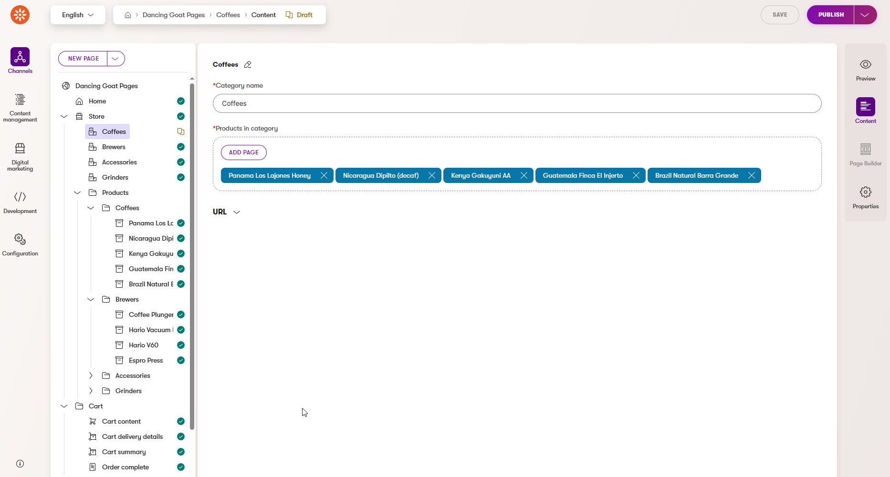

# Xperience by Kentico - KX 13 E-Commerce integration

[](https://github.com/Kentico/.github/blob/main/SUPPORT.md#labs-limited-support)
[](https://github.com/Kentico/xperience-by-kentico-ecommerce/actions/workflows/ci.yml)

**This integration is currently a Proof of Concept (PoC).  For further details, please refer to the [Support](#support) section and the [KenticoLabs](https://github.com/Kentico/.github/blob/main/SUPPORT.md#labs-limited-support) tag associated with this feature.**

| Name | Package |
| ------------- |:-------------:|
| Kentico.Xperience.K13Ecommerce | [](https://www.nuget.org/packages/Kentico.Xperience.K13Ecommerce) |
| Kentico.Xperience.Store.Rcl | [](https://www.nuget.org/packages/Kentico.Xperience.Store.Rcl) |
| Kentico.Xperience.StoreApi  | [](https://www.nuget.org/packages/Kentico.Xperience.StoreApi) |


## Description

This integration is primary intended for existing Kentico Xperience 13 (KX 13) E-Commerce projects to enable them to migrate
to new Xperience By Kentico (XbyK) and still use KX 13 E-Commerce functionality.\
It can also be used as a basis for new projects where E-Commerce data will be stored on KX 13, but further development is necessary to achieve this goal.

This solution covers several scenarios according to the complexity of integration between XByK and KX 13:

### Product listing widget
- We recommend to use this widget for simple scenarios such as Landing page offers, etc.
- [Product listing widget example](./examples/DancingGoat-K13Ecommerce/Components/Widgets/Store/ProductListWidget/StoreProductListWidgetViewComponent.cs)
is located in [Dancing Goat XbyK example project](./examples/DancingGoat-K13Ecommerce).
- The widget is used to display products directly from KX 13, purchase itself still takes place on Kentico 13.
- The widget has a couple of properties based on the [Store property selector](./src/Kentico.Xperience.K13Ecommerce/Components/FormComponents/KenticoStorePropertySelector/KenticoStorePropertySelectorComponent.cs) which enable to display products for given category, culture and currency.


### Full scale e-commerce solution
  - We recommend to use for possible partial migration of existing e-commerce projects from KX 13 to XbyK.
  - Product data (with variants and images) is [synchronized to Content hub](./docs/Usage-Guide.md#products-synchronization) (can be [turned off](./docs/Usage-Guide.md#setup-1)).
    
  - Product listing, detail and checkout process are placed on XbyK (shopping cart is saved and calculated still on KX 13).
    
  - Orders are created from cart, order related data is saved on KX 13 side.
  - Products need to be manually linked from Content hub to pages in website channel applications. You can use CI to restore examples of content types for pages that display products. 
    See [this section of User Guide](./docs/Usage-Guide.md#dancing-goat-example---setup) for detailed information.
    
  - [Sample XbyK Dancing Goat site](./examples/DancingGoat-K13Ecommerce) implements store functionality and can be used as an example of migration of existing e-commerce projects to new XbyK.

The integration provides an API with services for implementing the following scenarios:
  - Listing products based on parameters, product categories, prices and inventory
  - Actions with shopping cart, changing currency and order creation
  - Listing of orders (currently suitable for implementing listing orders in administration)
    - **Order updates and listing for specific customers are under development**
  - Listing site cultures and currencies
  - Check [this part of User Guide](./docs/Usage-Guide.md#kx-13-e-commerce-integration-in-xperience-by-kentico) for more specific description 


### Project structure

There are currently 2 solutions:

#### Kentico.Xperience.K13Ecommerce.sln

Complete solution with all libraries and sample sites:

- `Kentico.Xperience.StoreApi` - library for Kentico 13 that exposes a [REST API](./docs/Usage-Guide.md#store-api-kentico-xperience-13) for an E-Commerce site.
- `Kentico.Xperience.K13Ecommerce` - library for XbyK connecting to the REST Store API running under Kentico 13.
- `Kentico.Xperience.Store.Rcl` - Razor Class Library for selector components.
- Sample Dancing Goat sites
  - `DancingGoat.csproj` - XbyK Dancing Goat (live site channel + administration) enriched with integration to KX 13 Dancing Goat to show how to
create simple e-shop with product listing, product detail and checkout process on XByK.
  - `Kentico13_DancingGoat.csproj` - KX 13 Dancing Goat example (live site) with configured Store API to demonstrate how you can set up
REST Store API on your own KX 13 e-commerce solution.
- **KX 13 administration project (CMSApp) is not part of this solution!**


#### Kentico.Xperience.K13Ecommerce.Libs.sln
  - Contains only libraries without sample sites, used for publishing of NuGet packages

## Library Version Matrix

Summary of libraries which are supported by the following versions Xperince by Kentico / Kentico Xperience 13

### Kentico Xperience 13 E-Commerce integration

| Library                            | Xperience Version | Library Version |
|------------------------------------|-------------------| --------------- |
| Kentico.Xperience.Ecommerce.Common | \>= 29.0.1        | 1.0.0           |
| Kentico.Xperience.K13Ecommerce     | \>= 29.0.1        | 1.0.0           |
| Kentico.Xperience.Store.Rcl        | \>= 29.0.1        | 1.0.0           |
| Kentico.Xperience.StoreApi         | \>= 13.0.131      | 1.0.0           |

### Dependencies

Xperience by Kentico application:
- [ASP.NET Core 8.0](https://dotnet.microsoft.com/en-us/download)
- [Xperience by Kentico](https://docs.kentico.com/x/6wocCQ)

Kentico Xperience 13 application (or standalone API app):
- [ASP.NET Core 6.0](https://dotnet.microsoft.com/en-us/download)
- [Kentico Xperience 13 Refresh 11](https://docs.kentico.com/x/GQeRBg)

## Package Installation

### Xperience by Kentico

Add these packages to your XbyK application using the .NET CLI

```powershell
dotnet add package Kentico.Xperience.K13Ecommerce
dotnet add package Kentico.Xperience.Store.Rcl
```

### Kentico Xperience 13

Add this package to your Kentico Xperience 13 ASP.NET.Core application (live site or create standalone application 
when your KX 13 live site is not running)

```powershell
dotnet add package Kentico.Xperience.StoreApi
```
 
## Quick Start

### Kentico Xperience 13 

**First set up your Kentico 13 ASP.NET Core application**:

1. Set up your own [settings](.\examples\Kentico13_DancingGoatStore\appsettings.json) for Store REST API authentication (based on JWT and OAuth client credentials flow)
```json
{
  "CMSStoreApi": {
    "Jwt": {
      "Key": "YourSecretKeyForAuthenticationOfApplicationMustBeAtLeast64CharsLong",
      "Issuer": "yourCompanyIssuer.com",
      "Audience": "XbyK-DancingGoat",
      "TokenExpiresIn": 60
    },
    "ClientId": "3ef7fe1b-696c-4afa-8b56-d3176b7bea95",
    "ClientSecret": "********************"
  }
}
```

2. Add [Store API services](https://github.com/Kentico/xperience-by-kentico-ecommerce/blob/main/examples/Kentico13_DancingGoatStore/Startup.cs#L130) to application services and configure Swagger
```csharp
// Startup.cs

public void ConfigureServices(IServiceCollection services)
{
    // ...
    //Store API registration
    services.AddKenticoStoreApi();
    //Registers Swagger generation
    services.AddKenticoStoreApiSwagger();
}

public void Configure(IApplicationBuilder app, IWebHostEnvironment environment)
{
    //Registers Swagger endpoint middleware and swagger UI
    app.UseStoreApiSwagger();
}
```

### Xperience By Kentico

**Then set up your Xperience By Kentico application**

1. Fill [settings](.\examples\DancingGoat-K13Ecommerce\appsettings.json) to connect your Kentico Xperience 13 instance
```json
{
  "CMSKenticoStoreConfig": {
    "StoreApiUrl": "http://dev.dancinggoat.com:65375",
    "ClientId": "3ef7fe1b-696c-4afa-8b56-d3176b7bea95",
    "ClientSecret": "********************",
    "ProductSyncEnabled": true,
    "ProductSyncInterval": 10
  }
}
```
2. Add K13Ecommerce library to the [application services](https://github.com/Kentico/xperience-by-kentico-ecommerce/blob/main/examples/DancingGoat-K13Ecommerce/Program.cs#L61)
```csharp
// Program.cs

// Registers Kentico Store API and services for e-commerce support
builder.Services.AddKenticoStoreServices(builder.Configuration);
```
3. For the simplest scenario: copy [product listing widget](./examples/DancingGoat-K13Ecommerce/Components/Widgets/Store/ProductListWidget) from Dancing Goat example project to your project and configure
properties to display products from KX 13.
4. For more complex scenario with full e-shop, you can be inspired by implementation of [Dancing Goat sample Store](./examples/DancingGoat-K13Ecommerce) on XbyK.
Check [Usage guide](./docs/Usage-Guide.md#dancing-goat-example---setup) for detailed instructions to configure categories, products and cart steps.
5. Restore CI repository files to database (reusable content types, custom activities). CI files are located in
`.\examples\DancingGoat-K13Ecommerce\App_Data\CIRepository\` and you need to copy these files to your application.
```powershell
dotnet run --kxp-ci-restore
```
6. Start to use on your live site

## Full Instructions

View the [Usage Guide](./docs/Usage-Guide.md) for more detailed instructions.

## Contributing

To see the guidelines for Contributing to Kentico open source software, please see [Kentico's `CONTRIBUTING.md`](https://github.com/Kentico/.github/blob/main/CONTRIBUTING.md) for more information and follow the [Kentico's `CODE_OF_CONDUCT`](https://github.com/Kentico/.github/blob/main/CODE_OF_CONDUCT.md).

Instructions and technical details for contributing to **this** project can be found in [Contributing Setup](./docs/Contributing-Setup.md).

## License

Distributed under the MIT License. See [`LICENSE.md`](./LICENSE.md) for more information.

## Support

This contribution has __Kentico Labs limited support__.

See [`SUPPORT.md`](https://github.com/Kentico/.github/blob/main/SUPPORT.md#labs-limited-support) for more information.

For any security issues see [`SECURITY.md`](https://github.com/Kentico/.github/blob/main/SECURITY.md).
