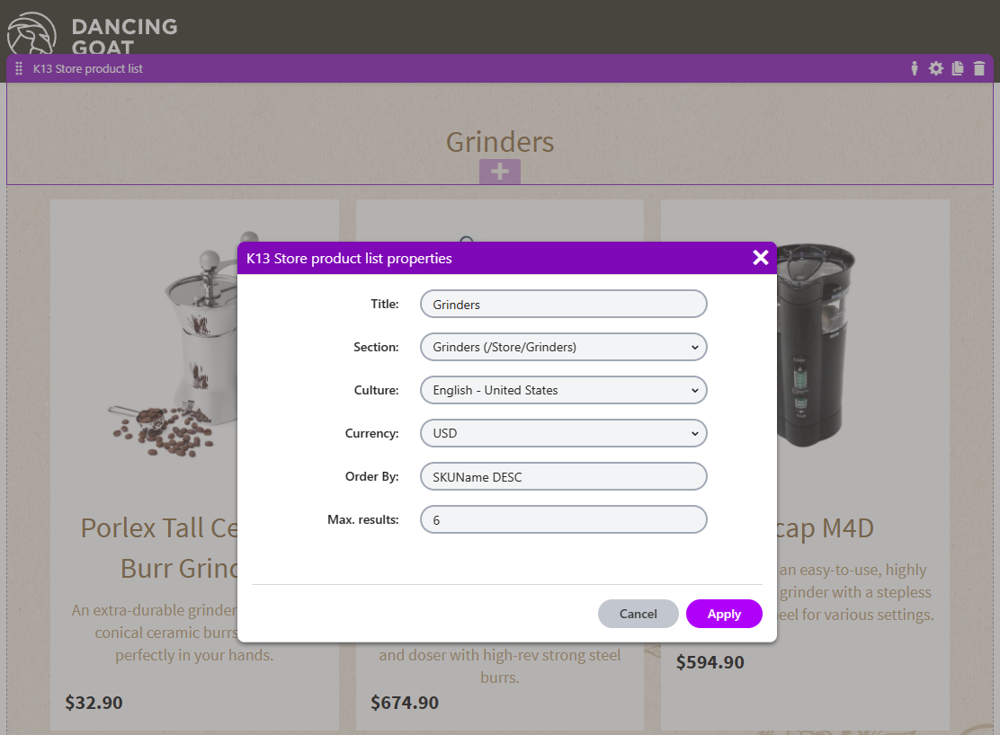
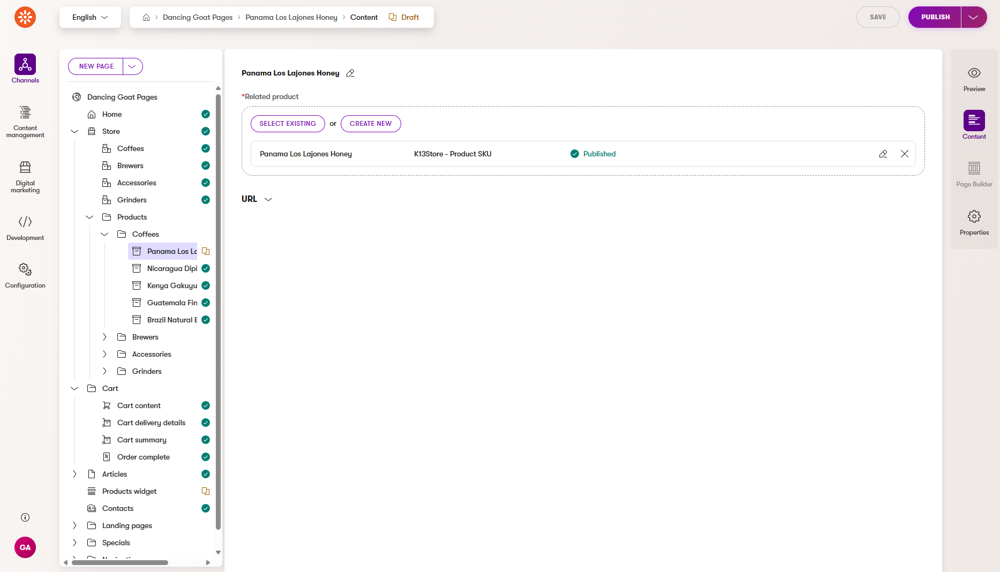
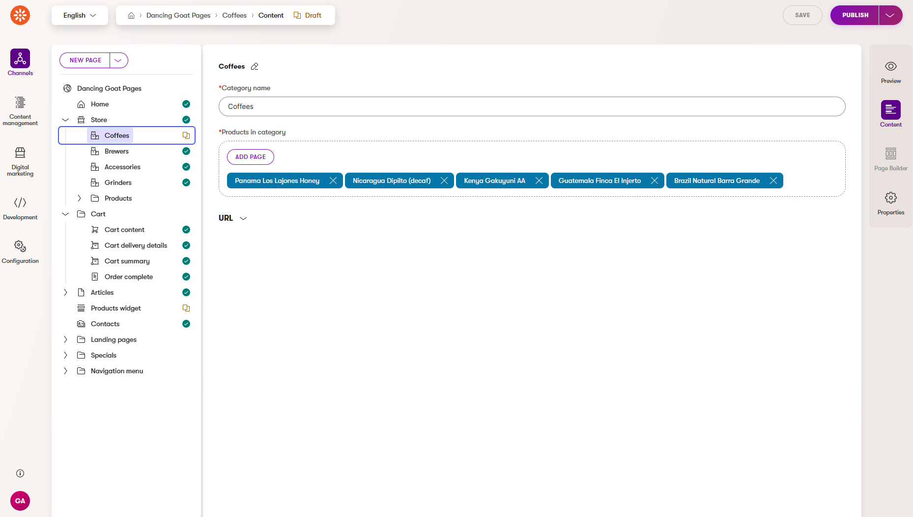
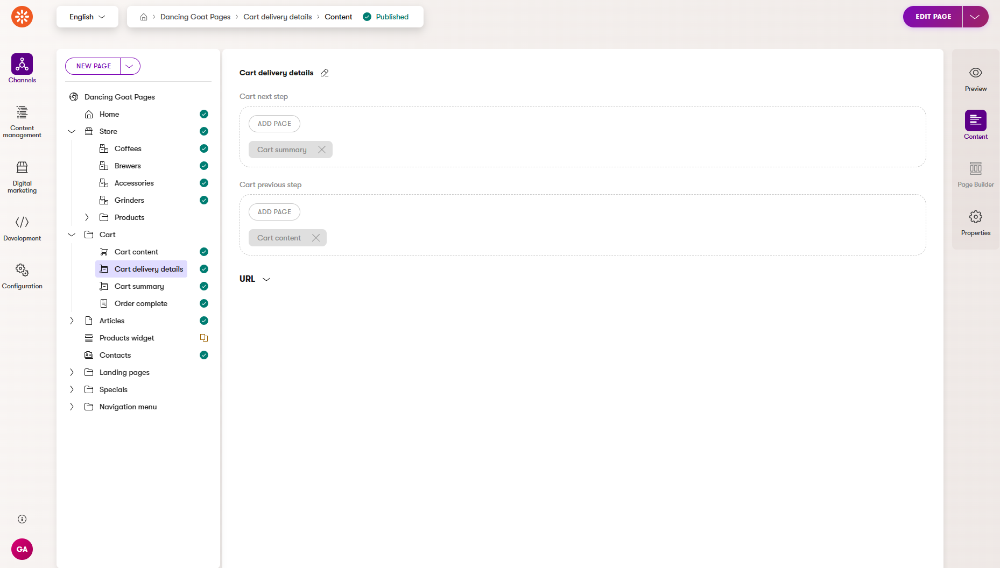

# Usage Guide

This user guide covers more detailed instructions for Xperience By Kentico (XbyK) integration to Kentico Xperience 13 (KX 13) E-Commerce features
to create E-Commerce solution on XbyK.

## Table of contents
1. [Store API (Kentico Xperience 13)](#store-api-kentico-xperience-13)
2. [K13 Ecommerce integration (Xperience by Kentico)](#k13-ecommerce-integration-in-xperience-by-kentico)
3. [Dancing Goat example - setup](#dancing-goat-example---setup)
4. [Scenarios](#scenarios)

## Store API (Kentico Xperience 13)

Store API (library `Kentico.Xperience.StoreApi`) is a REST API which exposes KX 13 E-Commerce features, and allows them to be consumed from other sources. 
(primary intended for Xperience By Kentico, but you are completely free to use it any way you want).

API is exposed via [Swagger](https://swagger.io/) ([Open API 3 standard](https://swagger.io/specification/)) on relative path `/swagger/storeapi/swagger.json`

> **_NOTE:_** To list all current endpoints with their request and response formats, run example project `Kentico13_DancingGoat`
> and go to address [Project_URL]/swagger with Swagger UI tool.

We recommend to use this API in combination with `Kentico.Xperience.K13Ecommerce` [library for XByK applications](#k13-ecommerce-integration-in-xperience-by-kentico),
because there are services to simplify e-commerce integration (such as `IShoppingService`) and [NSwag API client](https://learn.microsoft.com/en-us/aspnet/core/tutorials/getting-started-with-nswag?view=aspnetcore-8.0&tabs=visual-studio) is
already generated there.

### Authentication

API is intended to use with [OAuth 2.0 client credentials flow](https://datatracker.ietf.org/doc/html/rfc6749#section-4.4), when ClientId and ClientSecret are shared between
client application (XByK) and KX 13 application. Access tokens are generated in [JWT standard](https://jwt.io/introduction) (from endpoint `/api/store/auth/token`).
Token request can contain `user_email` parameter to identify for which user token is generated.
The endpoint validates that the user for given email exists, and then embeds it into the token as `sub` and `name` claims. All subsequent 
requests need to be [sent with Bearer token](https://www.dofactory.com/code-examples/csharp/authorization-header) in [Authorization](https://developer.mozilla.org/en-US/docs/Web/HTTP/Headers/Authorization) header.

All API controllers are secured by custom authorization attribute and filter `AuthorizeStore`. This filter checks
user claim and when this user exists and is enabled, is then assigned to `MembershipContext.AuthenticatedUser`. When
specific user email isn't provided, AuthenticatedUser remains as public user.

### Products

These endpoints have prefix `/api/store/products` and cover these domains:
- Getting product pages based on parameters (returned data can be [customized](https://github.com/Kentico/xperience-by-kentico-ecommerce/blob/main/examples/Kentico13_DancingGoatStore/Startup.cs#L134))
- Getting all product categories for given culture
- Getting prices and inventory info

### Shopping cart

These endpoints have prefix `api/store/cart` and cover work with current shopping cart. Many actions correspond
to functionality in KX 13 `CMS.Ecommerce.IShoppingService` (adding/removing items to cart, set delivery data, creating order etc.).
All endpoints use `ShoppingCartGUID` parameter sent 
in HTTP header to identify current shopping cart.
Management of this identifier is automatically handled in client (XByK) applications by the `Kentico.Xperience.K13Ecommerce` package.

All calls internally use IShoppingService with some
notable customizations to handle [retrieving cart](https://docs.kentico.com/x/gQuRBg) in RESTful manner.
These customizations are applied only on request with `api/store` prefix to not break default e-commerce functionality:
- Custom `IShoppingCartCache` - session usage is removed, cache key for cart's cache token identifier (`jti` claim) is
used instead.
So cache duration is also determined by current token expiration time and very short time for token expiration can cause
more frequent retrieving from database.
- Custom `ICurrentShoppingCartService` - session and cookie access is removed, current shopping cart is retrieved from
`ShoppingCartGUID` header value.

In all API responses current `ShoppingCartGuid` is always sent to ensure correct shopping cart is always saved on client application (XbyK)
in cases like user log in/log out.

#### Discounts
All KX 13 discounts and coupon codes are supported.

#### Currencies
By default shopping is calculated in main site's currency. Cart's currency can be changed via `api/store/cart/set-currency`.
All enabled currencies can be retrieved from `api/store/site/currencies`.

#### Current known limitations
Not all cart's data can be changed, e.g. custom data (properties like ShoppingCartCustomData) cannot be currently changed
via API.

### Orders
- Endpoint `api/store/order/list` for retrieving list of orders for current customer based on request (supports paging)
- Endpoint `api/store/order/admin/list` for retrieving list of orders (for all customers) based on request (supports paging) to display in XbyK administration (supports paging)
- Endpoint `api/store/order/detail/{orderID}` for retrieving order detail for current customer. If the order order belongs to another customer, no order is retrieved
- Endpoint `api/store/order/admin/detail/{orderID}` for retrieving order detail(without verifying if order belongs to current customer)
- Endpoint `api/store/order/statuses/list` for retrieving all order statuses
- Endpoint `api/store/order/update` for updating order(update order status, set order payment, etc.)

### Customers
- Endpoint `api/store/customer/addresses` for retrieving current customer's addresses
- Endpoint `api/store/customer/admin/addresses` for retrieving addresses of specific customer to display in XbyK administration

### Store site
- Endpoint `api/store/site/cultures` returns all enabled site cultures
- Endpoint `api/store/site/currencies` returns all enabled site currencies

### Members synchronization
When [member](https://docs.kentico.com/x/BIsuCw) is created on XbyK (for example when a new customer registers), this member needs to be synchronized to KX 13 as a user.
It is subsequently used for API authorization (member/user identity is generated in JWT).
Before you start using the Store API, you need to synchronize all website members between the client (XbyK) and your KX 13 application.
Complete synchronization is not part of this PoC solution.

- Endpoint `api/store/synchronization/user-synchronization` can be used to create a new user in KX 13
  - The client application (XbyK) should use this to ensure that all new members are synchronized to KX 13. This is necessary when client's
e-commerce solution allows visitors to sign in. KX 13 users are created with random generated password and are used only for
API authorization and assigning to MembershipContext.

> **_NOTE:_** Please implement double opt-in mechanism for user registration to ensure the users are paired safely between
> XbyK and KX 13. The current Dancing Goat example does not have a double opt-in mechanism implemented, but we recommend it as a best practice.

#### Current known limitations
Roles synchronization isn't currently supported. We assume website members to be already synchronized between client (XbyK) and KX app before starting using this API.

### Setup

**How to set up your Kentico 13 ASP.NET Core application**:

Add this package to your Kentico Xperience 13 ASP.NET.Core application (live site or create standalone application
when your KX 13 live site is not running)

```powershell
dotnet add package Kentico.Xperience.StoreApi
```

1. Set up your own [settings](../examples/Kentico13_DancingGoatStore/appsettings.json) for Store REST API authentication (based on JWT and OAuth client credentials flow)
```json
{
  "CMSStoreApi": {
    "Jwt": {
      "Key": "YourSecretKeyForAuthenticationOfApplicationMustBeAtLeast64CharsLong",
      "Issuer": "yourCompanyIssuer.com",
      "Audience": "XbyK-DancingGoat",
      "TokenExpiresIn": 60
    },
    "ClientId": "3ef7fe1b-696c-4afa-8b56-d3176b7bea95",
    "ClientSecret": "********************"
  }
}
```
**Setting description**

| Setting                        | Description                                                                   |
|--------------------------------|-------------------------------------------------------------------------------|
| Jwt:Key            | Your unique secret key for signing JWT access tokens (at least 64 chars long) |
| Jwt:Issuer         | Fill arbitrary value for this claim (as your domain)                          |
| Jwt:Audience       | Fill arbitrary value for this claim to identify recipients                    |
| Jwt:TokenExpiresIn | Duration in minutes for token validity                                        |
| ClientId           | Fill your value, used for getting token (client credentials OAuth 2.0 flow)   |
| ClientSecret       | Fill your value, used for getting token (client credentials OAuth 2.0 flow)   |


2. Add [Store API services](https://github.com/Kentico/xperience-by-kentico-ecommerce/blob/main/examples/Kentico13_DancingGoatStore/Startup.cs#L130) to application services and configure Swagger
```csharp
// Startup.cs

public void ConfigureServices(IServiceCollection services)
{
    // ...
    //Store API registration
    services.AddKenticoStoreApi();
    //Registers Swagger generation
    services.AddKenticoStoreApiSwagger();
}

public void Configure(IApplicationBuilder app, IWebHostEnvironment environment)
{
    //Registers Swagger endpoint middleware and swagger UI
    app.UseStoreApiSwagger();
}
```
or in [Minimal API](https://learn.microsoft.com/en-us/aspnet/core/fundamentals/minimal-apis/overview?view=aspnetcore-8.0) approach:
```csharp
// Program.cs

var builder = WebApplication.CreateBuilder(args);

// ...
//Store API registration
builder.Services.AddKenticoStoreApi();
//Registers Swagger generation
builder.Services.AddKenticoStoreApiSwagger();

var app = builder.Build();

//Registers Swagger endpoint middleware and swagger UI
app.UseStoreApiSwagger();

app.Run();

```

### Library matrix

| Library                            | Xperience Version | Library Version | NET version |
|------------------------------------|-------------------| --------------- |-------------|
| Kentico.Xperience.StoreApi         | \>= 13.0.131      | 1.0.0           | \>= .NET 6  |

## KX 13 E-Commerce integration in Xperience By Kentico

Library `Kentico.Xperience.K13Ecommerce` encapsulates Store API calls and exposes several services for KX 13 e-commerce
integration on XByK:

- `IProductService`
  - Listing products based on parameters, product categories, prices and inventory
  - Service is used e.g in [product synchronization](https://github.com/Kentico/xperience-by-kentico-ecommerce/blob/main/src/Kentico.Xperience.K13Ecommerce/Synchronization/Products/ProductSynchronizationService.cs#L36)
  or [in product list](https://github.com/Kentico/xperience-by-kentico-ecommerce/blob/main/examples/DancingGoat-K13Ecommerce/Controllers/KStore/StoreCategoryController.cs#L48) where prices are retrieved for listed products. 
- `IShoppingService`
  - Actions on shopping cart and order creation:
    - Adding/removing products to/from cart
    - Updating product quantity in cart
    - Adding/removing coupon codes
    - Retrieving cart content and delivery details
    - Retrieving current customer
    - Set shipping option and payment option
    - Set customer, billing and shipping address
    - Validate cart items
    - Change cart's currency
    - Create order
  - Service saves and retrieves the shopping cart identifier (`ShoppingCartGuid`) to session (uses `IShoppingCartSessionStorage`) 
and to browser cookie (uses `IShoppingCartClientStorage`)
  - See [CheckoutController in Dancing Goat example](../examples/DancingGoat-K13Ecommerce/Controllers/KStore/CheckoutController.cs) 
  where checkout process is implemented using this service.
- `ICustomerService`
  - List of customer addresses
  - Service is used e.g. in [CheckoutService in Dancing Goat example](../examples/DancingGoat-K13Ecommerce/Services/CheckoutService.cs) 
  where customer's addresses are retrieved in cart's second step.
- `IOrderService`
  - List of orders from all customers(for implementing listing orders in administration)
  - List of orders for current customer(based on request)
  - Order detail for current customer(only for orders that belong to the customer)
  - Order detail for administrator(without verifying if order belongs to current customer)
  - List of all order statuses
  - Update order
- `ISiteStoreService`
  - Use for retrieving site's [list of enabled cultures](https://github.com/Kentico/xperience-by-kentico-ecommerce/blob/main/src/Kentico.Xperience.K13Ecommerce/SiteStore/ISiteStoreService.cs#L13), e.g. for implementation of language selector
  - Use for retrieving site's [list of enabled currencies](https://github.com/Kentico/xperience-by-kentico-ecommerce/blob/main/src/Kentico.Xperience.K13Ecommerce/SiteStore/ISiteStoreService.cs#L18), e.g. for implementation of currency selector
- `ICountryService`
  - [Countries and states](../src/Kentico.Xperience.K13Ecommerce/Countries/ICountryService.cs) - these objects are already on XByK, there is no Store API call
    > **_NOTE:_** Countries and states are not synchronized between KX 13 and XbyK. As a result, any modifications or 
    additions to countries and states in KX 13 are currently not supported.

### Products synchronization

Library also implements product synchronization to Content hub. These are 3 entities synchronized to reusable content items:
- Products - Content type `K13Store.ProductSKU`
  - All products associated with product pages are synced. **Standalone SKUs** synchronization can be set via `StandaloneProductsSync` setting.
- Product variants - Content type `K13Store.ProductVariant`
  - All products variant for parent products
- Product images - Content type `K13Store.ProductImage`
  - Main SKU images (from SKUImagePath column)

The synchronization runs in a background thread worker periodically and can be disabled (`ProductSyncEnabled` setting).
Interval can be set in minutes (`ProductSyncInterval` setting). Synchronized data is updated when source value
changes, so data cannot be edited in XbyK safely, but new custom or reusable fields can be added and edited
safely. You can decide, whether include [standalone SKUs](https://docs.kentico.com/x/3gqRBg) or not (`StandaloneProductsSync` setting).

No price data is synced, because catalog prices need
calculator evaluation in context of user's cart and standalone requests via `IProductService` are required.

#### Limitations
Products are currently synchronized only in default content culture. **Same language needs to be enabled in XByK**.

### Activity logging
When you are using `IShoppingService` for shopping cart actions, these actions are logged to XByK [Online marketing activities](https://docs.kentico.com/x/dY3WCQ)
for current contact:

| Activity display name | Activity name | Description                                |
|---------------|---------------|--------------------------------------------|
| Product added to shopping cart | custom_productaddedtoshoppingcart     | Product added to cart                      |
| Product removed from shopping cart | custom_productremovedfromshoppingcart | Product removed from cart                  |
| Purchased product | custom_purchasedproduct            | Purchased product (after order is created) |
| Purchase | custom_purchase               | Order created                              |

You need to ensure these [custom activity types](https://docs.kentico.com/x/xoouCw) 
are created (via CI restore - see [Setup section](#setup-1) or [manually](https://docs.kentico.com/developers-and-admins/digital-marketing-setup/set-up-activities/custom-activities#add-custom-activity-types)).

### Email notifications
Currently all e-commerce email notifications are sent from KX 13 application. 
You need to have [configured email sending](https://docs.kentico.com/x/IQ_RBg) and 
[e-commerce email templates](https://docs.kentico.com/x/-wuRBg).

### Product listing widget
- We recommend to use this widget for simple scenarios such as Landing page offers, etc.
- [Product listing widget example](../examples/DancingGoat-K13Ecommerce/Components/Widgets/Store/ProductListWidget/StoreProductListWidgetViewComponent.cs)
  is located in [Dancing Goat XbyK example project](../examples/DancingGoat-K13Ecommerce).
- The widget is used to display products directly from KX 13, purchase itself still takes place on Kentico 13.
- The widget has a couple of properties based on the [Store property selector](../src/Kentico.Xperience.K13Ecommerce/Components/FormComponents/KenticoStorePropertySelector/KenticoStorePropertySelectorComponent.cs) which enable to display products for given category, culture and currency.



### Setup

Add these packages to your XbyK application using the .NET CLI

```powershell
dotnet add package Kentico.Xperience.K13Ecommerce
dotnet add package Kentico.Xperience.Store.Rcl
```

1. Fill settings to connect your Kentico Xperience 13 instance
```json
{
  "CMSKenticoStoreConfig": {
    "StoreApiUrl": "http://dev.dancinggoat.com:65375",
    "ClientId": "3ef7fe1b-696c-4afa-8b56-d3176b7bea95",
    "ClientSecret": "********************",
    "ProductSyncEnabled": true,
    "StandaloneProductSync": true,
    "ProductSyncInterval": 10
  }
}
```
**Setting description**

| Setting                        | Description                                                        |
|--------------------------------|--------------------------------------------------------------------|
| StoreApiUrl            | Fill main URL (without path) to KX 13 live app instance            |
| ClientId         | Fill same value which is defined on KX 13 side                     |
| ClientSecret      | Fill same value which is defined on KX 13 side                     |
| ProductSyncEnabled | If true, product synchronization is enabled                        |
| StandaloneProductSync | If true, [standalone SKUs](https://docs.kentico.com/x/3gqRBg) are synchronized as well                        |
| ProductSyncInterval                       | Interval in minutes specifies how often synchronization is running | 


2. Add K13Ecommerce library to the application services
```csharp
// Program.cs

// Registers Kentico Store API and services for e-commerce support
builder.Services.AddKenticoStoreServices(builder.Configuration);
```
3. For the simplest scenario: copy product listing widget from Dancing Goat example project to your project and configure
   properties to display products from Kentico 13. Sample widget is located [here](../examples/DancingGoat-K13Ecommerce/Components/Widgets/Store/ProductListWidget).
4. For more complex scenario with full e-shop, you can be inspired by implementation of [Dancing Goat sample Store](../examples/DancingGoat-K13Ecommerce) on XbyK.
   Check [Dancing Goat example - setup](#dancing-goat-example---setup) for detailed instructions to configure categories, products and cart steps.
5. Restore CI repository files to database (reusable content types, custom activities). CI files are located in
   `.\examples\DancingGoat-K13Ecommerce\App_Data\CIRepository\` and you need to copy these files to your application.
```powershell
dotnet run --kxp-ci-restore
```

6. Start to use on your live site

### Library matrix

| Library                            | Xperience Version | Library Version |
|------------------------------------|-------------------| --------------- |
| Kentico.Xperience.Ecommerce.Common | \>= 29.0.1        | 1.0.0           |
| Kentico.Xperience.K13Ecommerce     | \>= 29.0.1        | 1.0.0           |
| Kentico.Xperience.Store.Rcl        | \>= 29.0.1        | 1.0.0           |


## Dancing Goat example - setup

1. Go to `./examples/DancingGoat-K13Ecommerce` folder and run CI restore for content types and cart pages:

```powershell
dotnet run --kxp-ci-restore
```
All content types and custom activities for e-ecommerce events are created.

Except reusable content types used in product synchronization, additional content types for pages are restored:

These content types are restored for Store page, categories and product detail pages:

- `K13Store.StorePage` - Main store page
- `K13Store.CategoryPage` - Content type for category pages (with linking product pages)
- `K13Store.ProductPage` - Content type for product detail page - only linking product SKU from content hub

For checkout process these content types (for pages) are restored:
- `K13Store.CartContent` - used for the shopping cart first step
- `K13Store.CartDeliveryDetails`- used for the shopping cart second step
- `K13Store.CartSummary` - used for the shopping cart third step
- `K13Store.OrderComplete` - used for thank you page

2. Start sample KX 13 Dancing Goat application (`Kentico13_DancingGoat` in `.\examples`) configured with your own database

3. Start Xperience By Kentico Dancing Goat application (`DancingGoat` in `.\examples`) configured with your own database.\
Let the product synchronization finish. Check `K13-Store product synchronization done.` in debug console or check Event log for errors.
4. Create pages for Store:
   1. Store page (of type `K13Store - Store page`)
   2. Product pages (of type `K13Store - Product page`) - for each page select corresponding Product SKU from content hub.
   2. Categories pages (of type `K13Store - Category page`) - for each page select product pages in category
   3. Cart/Checkout steps pages
      1. Cart content page
      2. Cart delivery details page
      3. Cart summary page
      4. Order complete page

## Scenarios

### How to add products onto website?
The product synchronization creates reusable content items for products, product variants and product images.
It's on you how to display these product on your website. But you can use the approach from 
[Dancing Goat example](#dancing-goat-example---setup):
1. Create pages for products (e.g. in folder structure) in your web site channel and link them to product content items 
(of type `K13Store.ProductSKU`). You can use `K13Store.ProductPage` content type for this.

2. Create Store page (use `K13Store.StorePage` content type) which represents entry point for your store. You can display here main categories 
and Hot tip products. Skip this step when you don't need this type of page.
3. Create pages for categories (use `K13Store.CategoryPage` content type) and select product pages in Products in category field.


### How to display products on your website?

1. For displaying products on your live site, see [StoreCategoryController](../examples/DancingGoat-K13Ecommerce/Controllers/KStore/StoreCategoryController.cs)
on Dancing Goat example site. Products pages are retrieved for current category and current prices are retrieved for these products via `IProductService`.
2. You can also to consider using [Product listing widget](#product-listing-widget) for simple scenarios like Landing pages with product offer.

### How to implement shopping cart / checkout process?

1. Create pages representing cart steps
   1. Cart content page
   2. Cart delivery details page
   3. Cart summary page
   4. Order complete page\
   Set Cart next steps / Cart previous step fields for each step page. 
   
   This approach has the advantage that you can use [page builder features](https://docs.kentico.com/x/6QWiCQ) for each step.
2. For shopping cart and checkout process implementation, see [CheckoutController](../examples/DancingGoat-K13Ecommerce/Controllers/KStore/CheckoutController.cs)

Here are links for some specific parts of shopping cart:

- [Shopping cart content](https://github.com/Kentico/xperience-by-kentico-ecommerce/blob/main/examples/DancingGoat-K13Ecommerce/Controllers/KStore/CheckoutController.cs#L84)
- [Discount / Coupon codes](https://github.com/Kentico/xperience-by-kentico-ecommerce/blob/main/examples/DancingGoat-K13Ecommerce/Controllers/KStore/CheckoutController.cs#L163)
- [Delivery details + shipping](https://github.com/Kentico/xperience-by-kentico-ecommerce/blob/main/examples/DancingGoat-K13Ecommerce/Controllers/KStore/CheckoutController.cs#L194)
- [Payment](https://github.com/Kentico/xperience-by-kentico-ecommerce/blob/main/examples/DancingGoat-K13Ecommerce/Controllers/KStore/CheckoutController.cs#L330)
- Payment gateway - Is not part of this PoC solution, you need to implement integration with specific payment gateway.
- [Order creation](https://github.com/Kentico/xperience-by-kentico-ecommerce/blob/main/examples/DancingGoat-K13Ecommerce/Controllers/KStore/CheckoutController.cs#L315)


### How to handle order payments?
1. Implement your own payment method.
2. Retrieve all order statuses using `IOrderService` if needed.
3. Use `UpdateOrder` method of `IOrderService` to update order status and to set `OrderIsPaid` flag according to the payment result.